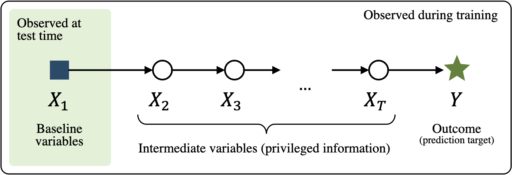

# Long-term Prediction with Privileged Time Series in Linear Dynamical Systems

This repository is the official implementation of [Long-term Prediction with Privileged Time Series in Linear Dynamical Systems](). 

### To-do list
- [x] Create a requirements.txt file
- [x] Add a figure to describe the problem setup 
- [x] Add executable experiment for synthetic
- [x] Add executable experiment + data (link or dataset) for FC
- [x] Add code for ADNI
- [x] Add code for MM
- [ ] Make repo public
- [ ] Eventually: Add arXiv link

### Abstract
We study learning of predictive models of long-term outcomes that are given access to privileged information in the form of intermediate time series. These time series, available only in training samples, are observed chronologically between the baseline (time of prediction) and the outcome. We give an algorithm for this setting and prove that when the time series are drawn from a Gaussian-linear dynamical system, learning with privileged information is more efficient than learning without it. On synthetic data, we test the limits of our algorithm and theory,  both when our assumptions hold and when they are violated. On three diverse real-world datasets, we show that our approach is preferable to classical learning of predictive models in almost all settings, particularly when data is scarce.

## Requirements

Required libraries found in *requirements.txt*

## Models
Baseline and LUPTS are implemented using *sklearn*, the code is found in /src/model/

## Evaluation

### Synthethic

To re-produce experiments, run /notebooks/synthetic.ipynb
Necessary experiment code is found in src/synthetic/

### Forecasting Air Quality

To re-produce experiments, run /notebooks/fivecities.ipynb
Necessary experiment code is found in src/fivecities/

The data is found in */data/fivecities/*, but can also be downloaded from [here](https://archive.ics.uci.edu/ml/datasets/PM2.5+Data+of+Five+Chinese+Cities).

### Modeling Progression of Chronic Disease

**Note**: For the Alzheimer’s and Multiple myeloma progression modeling tasks, the data is not publicly available, but the code which produced the results is still found in this repository. 

#### Alzheimer's progression modelling
Code is found in /notebooks/ADNI.ipynb and /src/adni/

#### Multiple myeloma progression modelling
Code is found in /notebooks/mm-prfs.ipynb and /notebooks/mm-tr.ipynb

## Bibtex entry for citation

- [ ] To be filled out
